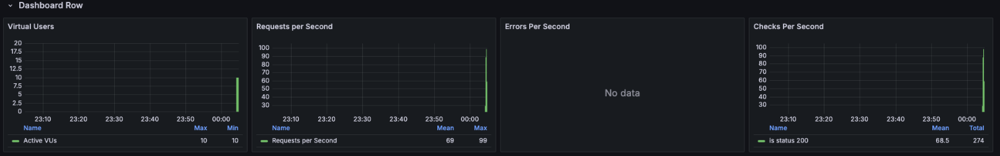
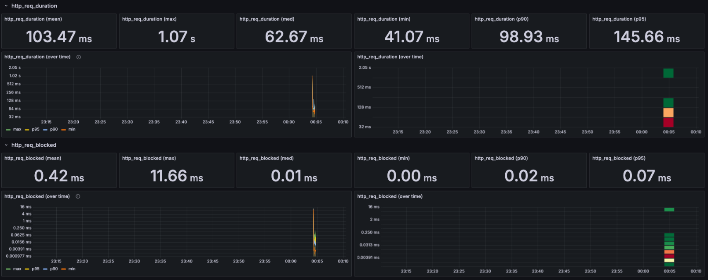

# 도커 컴포즈

단일 서버에서 여러개의 컨테이너를 하나의 서비스로 정의해 컨테이너 묶음으로 관리할 수 있는 작업환경을 제공하는 관리도구

# Grafana

- **Virtual Users**: 부하 테스트에 참여 중인 가상 사용자 수를 보여줍니다.
    - Max, Min: 최대, 최소 동시 접속자
- **Requests per Second**: 초당 처리되는 요청 수입니다.
    - Mean: 평균 요청 수
    - Max: 최대 요청 수
- **Errors Per Second**: 초당 발생하는 오류 수입니다. "No data"로 표시되어 있어 현재 오류가 없거나 측정되지 않고 있습니다.
- **Checks Per Second**: 초당 수행되는 상태 확인 횟수입니다.
    - Mean : 평균횟수
    - Total: 총 횟수

- **http_req_duration (mean)**: HTTP 요청의 평균 처리 시간 - 35.24 밀리초
- **http_req_duration (max)**: HTTP 요청의 최대 처리 시간 - 998.73 밀리초
- **http_req_duration (med)**: HTTP 요청의 중간값(median) 처리 시간 - 12.44 밀리초
- **http_req_duration (min)**: HTTP 요청의 최소 처리 시간 - 1.14 밀리초
- **http_req_duration (p90)**: 상위 90% 요청의 처리 시간 - 60.25 밀리초 (90%의 요청이 이 시간보다 빠르게 처리됨)
- **http_req_duration (p95)**: 상위 95% 요청의 처리 시간 - 69.96 밀리초 (95%의 요청이 이 시간보다 빠르게 처리됨)

- **http_req_blocked (mean)**: 요청이 차단된 평균 시간 - 0.42 밀리초
- **http_req_blocked (max)**: 요청이 차단된 최대 시간 - 11.66 밀리초
- **http_req_blocked (med)**: 요청이 차단된 중간값(median) 시간 - 0.01 밀리초
- **http_req_blocked (min)**: 요청이 차단된 최소 시간 - 0.00 밀리초
- **http_req_blocked (p90)**: 상위 90% 요청의 차단 시간 - 0.02 밀리초 (90%의 요청이 이 시간보다 짧게 차단됨)
- **http_req_blocked (p95)**: 상위 95% 요청의 차단 시간 - 0.07 밀리초 (95%의 요청이 이 시간보다 짧게 차단됨)

`http_req_blocked`는 TCP 연결 설정, DNS 조회, TLS 핸드셰이크 등 요청이 실제로 전송되기 전에 발생하는 지연 시간을 포함합니다. 이 값이 낮을수록 네트워크 연결이 효율적으로 설정되고 있다는 의미입니다.