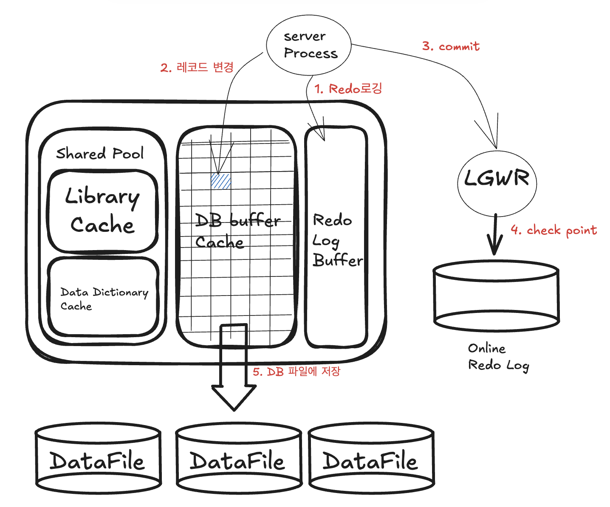

> 친절한 SQL 튜닝 참고

# 1. SQL 처리과정과 I/O

# SQL 파싱과 최적화

## SQL 최적화

1. 파싱트리 생성: SQL문을 이루는 개별 요소 분석 후에 트리 생성
2. Syntax 체크: 문법적 오류 체크
3. Semantic 체크: 의미상 오류 체크

2. SQL 최적화

- 옵티마이저가 선택한 경로를 실행 가능한 형태

3. 로우 소스 생성

- 옵티마이저가 선택한 경로를 실행 가능한 형태(프로시저)로 포맷팅

## SQL 옵티마이저

- 옵티마이저가 Decision Tree를 타고 최저 비용을 구한다.

## 실행계획과 비용 - 옵티마이저가 생성한 처리 절차

- 실행경로 변경 가능 -> 옵티마이저 힌트

# SQL 공유 및 재사용

## 소프트파싱 vs 하드파싱

- Library cache: 위의 최적화 과정을 거쳐 생성한 내부 프로시저를 재사용 가능하게 캐싱해둔 곳
- 소프트파싱: 캐시에서 SQL 문을 찾아 곧바로 실행 단계로 넘어가는 것
- 하드파싱: 캐시에서 찾는 것을 실패해서 위 과정을 거치는 것

* SQL은 문자열이고 별도의 이름이 없어 내용으로 식별, 완전히 같아도 각각 최적화를 진행하고 별도 공간 사용
* Prepare statement

- SQL문을 미리 컴파일하여 실행계획을 세우고 실행시점에 값을 바인딩하여 사용하는 방식
  예시) "SELECT * FROM CUSTOMER WHERE LOGIN_ID = ?"

- ? 에 값을 채움(추상화와 비슷)

# 데이터 저장 구조 및 I/O 메커니즘

## 데이터베이스 저장 구조

- 블록: 데이터 읽고 쓰는 단위(I/O단위)
- 익스텐트: 공간을 확장하는 단위, 연속된 블록 집합
- 세그먼트: 데이터 저장공간이 필요한 오브젝트(익스텐트 집합)
- 테이블스페이스: 세그먼트를 담는 컨테이너
- 데이터파일: 디스크상의 물리적 OS 파일

## 논리적 I/O vs 물리적 I/O

* 논리적 I/O를 줄임으로써 물리적 I/O를 줄이는 것이 곧 튜닝이다.

## Table Full Scan vs Index Range Scan

- 데이터가 소량일 땐 인덱스가 유리, 데이터가 일정량을 넘어가면 Full Scan이 유리

# 2. 인덱스 기본

# 인덱스 구조 및 탐색

- DB테이블에서 데이터를 찾는 방법

1. Full Scan
2. 인덱스를 이용

## 인덱스란?

- <키, ROWID>쌍을 정렬하여 보관하는 데이터 구조. B-Tree 구조로 키값으로 해당 데이터가 저장된 ROWID를 찾는다.
- 인덱스 스캔과 랜덤액세스
  ** SQL 튜닝은 랜덤 I/O와의 전쟁이다 **

## 인덱스 구조

- 수직적 탐색: 인덱스 스캔 시작지점 찾는 과정
- 수평적 탐색: 데이터를 찾는 과정

* 인덱스를 가공하면 정상적으로 스캔 시작점을 찾을 수 없기 때문에 Range Scan이 불가해진다.

### 인덱스를 정상적으로 사용불가한 조건절

- WHERE Substr(생년월일, 5, 2) = '05' // 컬럼값 변환시킴
- WHERE nvl(주문수량, 0) < 100 // 컬럼값 변환시킴
- WHERE 업체명 like '%대한%' // 와일드카드가 앞에 있어서
- WHERE (전화번호 = :tel_no AND 고객명 = cust_nm) // 각 조건에 따라 별도 인덱스 사용
- WHERE 전화번호 in(:tel_no1, :tel_no2) // 전화번호 컬럼 인덱스 여부 따져야 한다. 각 값에 대해 인덱스 수행해야 한다. Full Scan이 효율적일 수도 있다.

## 인덱스를 이용한 sort 연산 생략

- 전체 테이블 스캔 n
- 인덱스 사용 logn
- 인덱스를 사용하면 정렬된 상태 반환. SORT ORDER BY 연산x

## 자동형변환

(약함) 문자형(CHAR, VARCHAR) < 숫자형(INTEGER, DECIMAL) < 날짜/시간형(DATE, TIMESTAMP) (강함)

- 날짜 포맷을 정확히 지정해주어야 한다.

# 인덱스 확장기능 사용법

- 여러 인덱스 스캔 방식

1. Index Range Scan - 가장 일반적 수직 + 수평
2. Index Full Scan - 처음 ~ 끝까지 수평 탐색
3. Index Unique Scan - only 수직탐색, UQ '=' 조건탐색
4. Index Skip Scan - 선두컬럼 개수 적고 후행컬럼은 많을 때 ex)성별이 선두컬럼, 후행컬럼은 연봉
5. Index Fast Scan - 순서(인덱스) 무시하고 쭉 읽는다.

- Multiblock I/O 방식으로 대량의 인덱스 블록 읽을 때 효과 상승, 정렬 x

6. Index Range Scan Descending - 1번을 내림차순

# 3. 인덱스 튜닝

# 테이블 액세스 최소화

## 인덱스 클러스터링 팩터 (CF)

- 클러스터가 얼마나 잘 모여 있나?
- 최후의 방법(수동)

## 인덱스 손익분기점

- CF 효과 p137 참고(CF에 따른 블록 I/O 발생량의 차이)

## OLTP 환경에서 부분범위 처리에 의한 성능개선

- OLTP(Online Transaction Processing): 소량, realtime
- OLAP(Online Analysis Process): 대량, batch

## 인덱스 구조 테이블

- IOT(Index Organized Table)
- 랜덤액세스 발생 x
- 극단적, 테이블 두개 합치기

# 인덱스 스캔 효율화

- 운영환경에서 가능한 일반적인 튜닝기법은 인덱스 컬럼 추가

## 인덱스 탐색

- Range가 좁을수록 빠르다.
- 등치면 한번에 간다.(제일 빠름)
- 첫 번째 조건이 넓으면 뒤에서 좁히기 어렵다.

** 중간에 조건절이 빠지면 뒤의 조건들은 없는 것이나 마찬가지 **

## 액세스 조건과 필터조건 - 인덱스 스캔 효율성 필수 개념

## 순서에 따른 군집성

- 등치조건을 앞쪽에
- 넓은 범위를 앞쪽에 두면 그 뒤로는 제 역할 못한다.

## BETWEEN을 IN-LIST로 전환

- 운영시스템에서 인덱스 구성의 변경이 불가할 때
- 옵티마이저가 범위를 등치로 바꾼다.
- 쿼리가 3개지만 느린 1개보다 빠를 수 있다.
- 데이터가 너무 많을 때는 사용x
- 레코드가 서로 멀리 떨어져 있을 때 유용

## BETWEEN과 LIKE 스캔 범위 비교

- BETWEEN을 사용하는 게 더 낫다.
- 데이터 분포와 조건절 값에 따라 인덱스 스캔량 차이 있다.

## 함수호출부하 해소를 위한 인덱스 구성

- java 함수 쓰면 성능 떨어진다. ex)encryption()

### PL/SQL 사용자 정의함수가 느린 이유

1. 가상머신상에서 실행되는 인터프리터 언어
2. 호출 시마다 문맥교환 발생
3. 내장 SQL에 대한 RECURSIVE CALL 발생

# 인덱스 설계

## 인덱스 설계가 어려운 이유

### 인덱스가 많을 때의 문제점

- DML성능 저하
- DB 사이즈 증가
- DB 관리 및 운영 비용 상승

## 가장 중요한 두가지 선택 기준 - "기본 공식"

- 결합 인덱스를 구성할 때

1. 조건절에 항상 사용하거나 자주 사용하는 균형을 선정한다.
2. '=' 조건으로 자주 조회하는 컬럼을 앞쪽에 둔다.

## 스캔 효율성 이외의 판단 기준 - "기본 2가지 + @"

- 수행빈도
- 업무상 중요도
- CF
- 데이터량 등등...

## 공식대로 흘러가는 것만은 아니다.

- 가계약 테이블을 생각해보면 Insert가 많이 발생
- 일자, 일시 조건을 선두에 두고, 자주 사용하는 필터 조건을 모두 뒤쪽에 추가하는 방식
- 일자 조회구간이 길지 않으면 영향 크지 않다.
- 인덱스 스캔 효율보다 테이블 엑세스가 더 큰 부하요소이다.

# 4. 조인튜닝

# NL조인

- index를 이용한 소량 join
- n x logn 조인, 뒤에 n이 커야 효율적

## NL조인 실행계획 제어

- 세개이상 테이블 조인할 때 leading 힌트를 사용하는것이 기존 쿼르를 건드리지 않아서 좋다.

## NL조인의 특징

1. 랜덤 엑세스 위주의 조인방식이다.

- 랜덤 엑세스: 블럭을 통째로 읽는 방식. 대량에 안좋음

2. 조인을 한 레코드씩 순차적으로 진행

- 때문에 큰 테이블을 조인해도 부분범위처리를 활용하면 매우 빠르다.

- 이런 특성을 고려할 때 NL조인은 소량 데이터를 처리하거나 부분처리가 가능한 OLTP에 적합!

# 소트 머지 조인

- 단계: 1.소트(조인 컬럼 기준 정렬) 2.머지
- index 이용 못할 때 사용(소트 필요하다.)
- 대향 데이터 조인일 때

## PGA(Private Global Area)

- 오라클은 SGA에 공유된 데이터를 읽고 쓰면서 자신만의 고유 메모리 영역을 갖는다. PGA라고 부르는
- 프로세스의 고유 데이터를 저장하는 용도로 사용
- 공간이 너무 작아 데이터를 모두 저장할 수 없을 때는 "TEMP 테이블 스페이스"를 이용

** 튜닝 포인트 : PGA로 넘어가면 디스크를 사용하게 됨으로 속도가 떨어진다.  **

## NL조인 vs 소트머지

- NL조인은 인덱스를 이용한 조인. 따라서 모든 블럭을 버퍼 캐시를 경유한다. 없을 경우 '건건이' 디스크에서 읽어들인다.
  하지만, 소트 머지는 일괄적으로 읽어 PGA에 저장한 후 조인. 따라서 래치 획득과정이 없다.

## 소트머지 조인의 주 용도

- 조인 조건식이 등치(=) 조건이 아닌 대량 데이터 조인
- 조인 조건식이 아예 없는 조인(카타시안 곱)

# 해시 조인

- 단계: 1. 빌드(작은 테이블로 해시 맵 생성) 2.탐색(큰 테이블을 읽어 해시 테이블 탐색 후 조인)
- 인덱스 사용x, 대량 조인에 좋다
- 소트 필요 없다.
- 소트 머지는 메모리를 많이 사용(PGA 넘어가면 Temp) 떄문에 해시 조인을 많이 쓴다.

## 세개 이상 테이블 해시 조인

- A, B, C 세개 테이블을 조인하는 경로는
- (A * B) * C
- (A * C) * B
- (C * B) * A 이렇게 3가지

## 조인 메서드 선택 기준

1. 소량데이터: NL조인
2. 대량데이터: 해시조인
3. 대량인데 조인 조건식이 등치(=)조건이 아닐 때 혹은 조인 조건이 아예 없을 떄. 소트머지 조인

## 수행빈도가 매우 높은 쿼리의 경우

- 가능하면 NL조인을 사용한다. -> 인덱스가 이미 만들어져 있기 때문에 그렇다. 다른 조인들은 cpu를 일 시키는 거니까.

# 서브쿼리 조인

- 오라클에서는 3가지로 분류

1. 인라인 뷰: From절에 사용한 서브쿼리
2. 중첩된 서브쿼리: WHERE절에 사용한 서브쿼리
3. 스칼라 서브쿼리: 하나의 레코드당 하나의 값을 반환하는 서브쿼리

## 서브쿼리 Unnesting

- Unnesting 이란?
- 서브쿼리를 따로 빼서 Join하는 것.
- 서브쿼리가 메인 쿼리와 독립적으로 실행되어서 한행씩 처리하면 각 행마다 서브쿼리가 반복실행되니까 따로 빼는 것이다.

### Semi-Join

- 첫 테이블의 행을 반환하지만 두번째 테이블의 데이터는 반환하지 않는다. 두번째 테이블의 조건만 맞는지 확인. in과 Exists사용
- 장점: 데이터량 낮아진다. 단순화.

# 5. 소트튜닝

## 소트 수행과정

- PGA에 할당된 Sort Area가 다차면 Temp 테이블 스페이스 활용

### 소트 두가지 유형

- 메모리 소트: 메모리 내에서 정렬 완료
- 디스크 소트: 디스크 공간까지 사용하는 경우.

- ** 머지소트: 추가적인 공간 (PGA)를 필요로 하는게 단점이다.
- 소트연산은 메모리 집약적, cpu 집약적(계속 비교하기 때문에)이다.
- 처리할 데이터량이 많아지면 디스크 I/O까지 발생 -> 쿼리 성능을 좌우하는 요소!

# 소트가 발생하지 않게 SQL 작성!

## Union vs Union All

- 상호베타적인 집합은 Union All
- Union All은 데이터 중복이 발생할 수도 있다.
- 소트연산이 일어나지 않도록 Union All 사용하면서도 데이터 중복을 피하려면 조건절에서 걸러주면 된다.

## Exists 활용

- Distinct는 조건에 해당하는 데이터를 모두 읽어 중복을 제거해야 함(모두 읽기 때문에 부분처리 불가. 많이 I/O 발생)
- Minus(차집합)은 NOT Exists변환 가능.

# 인덱스를 이용해서 소트를 생략하자!

## Soort Order By 생략

## Top N 쿼리

- 전체 결과집합중에 상위N개 레코드만 선택하는 쿼리
- COUNT(STOPKEY): 지정한 건수만큼 결과 레코드를 얻으면 거기서 멈춘다는 뜻.
- Top N stopkey 알고리즘

### 페이징처리

- 부분범위처리 가능하게 SQL 작성

1. 인덱스 사용가능하도록 조건절 구사
2. 조인은 NL위주로 처리
3. Order By절 있어도 소트연산 생략 가능하게 인덱스 구성

# Sort Area 적게 사용하도록 SQL작성! (데이터야이 적어지게)

## Sort Data 줄이기.

## Top N 쿼리 소트 부하 경감 원리.

예시) 전교생 1000명 중 가장 큰 10명 선발

1. 전교생 운동장 집합
2. 맨 왼쪽 학생 10명 키 순서대로 세우기
3. 나머지 990명을 한명씩 Top10과 비교
4. 새로 Top10에 진입한 학생키에 맞춰 자리 재배치 -> Top N 소트

# 6. DML튜닝

# 기본 DML 튜닝

## DML성능에 영향을 미치는 요소

- 인덱스
- 조건절
- ReDo, UnDo 로깅
- 무결성 제약
- 서브쿼리
- Lock
- 커밋

### 인덱스와 DML 성능

- FreeList: 테이블마다 데이터 입력 가능한 블록 리스트
- 인덱스 개수는 DML성능에 큰 영향, 인덱스 설계 중요하다.

### 무결성 제약과 DML 성능

- 개체 무결성 - PK
- 참조 무결성 - FK
- 도메인 무결성
- 사용자 정의 무결성(또는 업무 제약조건)
-
    * DBMS에서 PK,FK,Check,Not Null 같은 제약을 설정하면 더 완벽한 데이터 무결성을 지켜낼 수 있다.

### Redo 로깅과 DML성능

- 오라클은 데이터 파일과 컨트롤 파일에 가해지는 모든 변경사항을 Redo로그에 기록 (다시 실행 가능하게)
- DML수행시 Redo로그 생성. 따라서, 성능에 영향있다
- Insert 작업에 대해 Redo 로깅생략 기능을 제공하는 이유이다. (대용량 처리시 Redo로깅 off 해야됨)

### Redo 로그의 용도

- DataBase Recovery
- Cache Recovery
- Fast Commit - 커밋이 안되어 있는데 미리 보내기 (단점: 자료가 날라갈 수 있다.)

### Undo 로깅과 DMl성능

- 과거에는 롤백이라고 부름
- 변경된 블럭을 이전 상태로 되돌릴 때 필요한 정보 로깅
- Redo처럼 DML마다 생성 -> 성능에 영향 큼

### Undo 로그의 용도

1. Tx Rollback
2. Tx Recovery
3. Read consistency: 일관된 읽기, 내가 작업중 외부 영향 안받는다.

### MVCC(Muti - version Concerruncy Control)

- 버전 많을 때 일관된 데이터 만들 때 사용

1. Current 모드

- 디스크에서 캐시로 적재된 원본 블록을 현재 상태로 읽는 방식

2. Consistent 모드

- 쿼리 시작이후 다른 Tx에 의해 변경된 블록 만나면 복사본 블록 만들고 undo 데이터 적용하여 쿼리가 시작된 지점으로 되돌려 읽는 방식.
-
    * DML문은 Consistent 모드로 대상 레코드 찾고 Current모드로 추가/변경/삭제 한다. (복사본 변경작업할 수 없으니까)

### Lock 과 DML성능

- Lock을 필요이상으로 자주. 길게 사용하면 안됨, 그렇다고 적게 짧게 쓰면 데이터 품질 떨어짐

### 커밋과 DML 성능

- DML이 LOCK에 의해 블락킹 됐을경우, DML을 완료할 수 있게 LOCK을 푸는 키가 커밋

### 커밋의 내부 메커니즘

1. DB 버퍼캐시

- DBWR프로세스가 버퍼캐시에서 변경된 블록을 모아 데이터 파일에 일괄기록.

2. Redo 로그버퍼

- 버퍼캐시는 휘발성. butm 버퍼캐시에 가한 변경사항을 Redo 로그에도 기록

3. Tx 데이터 저장 과정

1. DML문 실핼, Redo 로그버퍼에 변경사항 기록
2. 버퍼블럭 데이터를 변경(레코드 추가/삭제/수정) 버퍼캐시에서 몾찾으면 데이터 파일에서 읽기부터
3. 커밋
4. LGWR 프로세스가 Redo 로그버퍼 내용을 로그파일에 일괄저장
5. DBWR 프로세스가 변경된 버퍼 블록들은 데이터 파일에 일괄 저장

# Direct Path I/O 활용

## Direct Path Insert

- 일반적인 INSERT문은 느리다
- Direct Path I/O가 빠른 이유는:

1. Freelist를 참조하지 않고 HWM 바깥 영역에 데이터를 순차적으로 입력
2. 블록을 버퍼 캐시에서 탐색하지 않음
3. 버퍼캐시에 적재하지 않고 데이터 파일에 직접 기록
4. Undo 로깅을 하지 않음
5. Redo 로깅 선택 가능

### Direct Path I/O 주의사항

1. TM Lock이 걸려 커밋 전까지 해당 테이블에 다른 트랜잭션은 DML 수행 불가
2. 테이블의 여유 공간을 활용하지 못함

# 파티션을 활용한 튜닝

## 테이블 파티션

- Range 파티션
- Hash 파티션
- List 파티션

## 인덱스 파티션

- 로컬 파티션 인덱스
    - 각 테이블 파티션과 인덱스 파티션이 1:1 매칭
    - 로컬이 아니면 모두 글로벌 파티션 인덱스임

# Lock과 트랜잭션 동시성 제어

## 오라클 Lock: 공유 리소스와 사용자 데이터 보호

### 종류

- DML Lock, DDL Lock, Latch, 버퍼 Lock 등

### DML Lock

1. DML Row Lock

- 두 개의 트랜잭션이 같은 로우를 변경하는 것을 방지
- 배타적 모드로, UPDATE나 DELETE 중에는 다른 트랜잭션의 UPDATE, DELETE가 불가능
- INSERT에 대한 로우 Lock 경합은 Unique 인덱스가 있을 때만 발생. 두 트랜잭션이 서로 다른 값을 입력하거나 Unique 인덱스가 없으면 경합 발생하지 않음

**DML Row Lock에 의한 성능저하를 방지하려면 온라인 트랜잭션 처리 중에 Lock을 필요 이상으로 오래 유지하지 않도록 커밋 시점을 조절해야 함**

2. DML Table Lock

- 오라클은 DML Row Lock 설정하기 전에 테이블 Lock을 먼저 설정
- 테이블 구조 변경을 방지하기 위해 테이블 Lock과 로우 Lock을 함께 설정
- Table Lock은 테이블 전체에 Lock을 건다는 의미가 아니라, 해당 테이블에서 현재 어떤 작업을 수행 중인지 알리는 표시임

### 대상 리소스가 사용 중일 때

1. Lock 해제를 기다림
2. 일정 시간 기다리다 포기
3. 기다리지 않고 즉시 포기

## 채번 방식에 따른 INSERT 성능 비교

- INSERT, UPDATE, DELETE, MERGE 중 가장 튜닝 요소가 많은 것은 INSERT임. 채번 방식에 따른 성능 차이가 큼
- 신규 데이터를 테이블에 입력하려면 PK 중복 방지를 위한 채번이 선행되어야 함

### 가장 많이 쓰는 세 가지 채번 방식

1. 채번 테이블
2. 시퀀스 오브젝트
3. Max + 1g