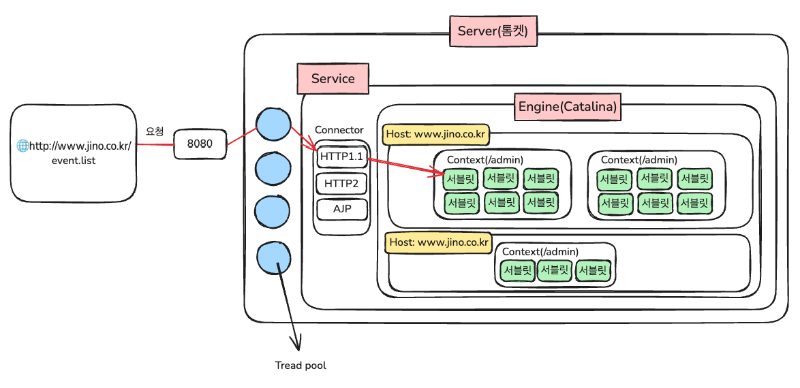
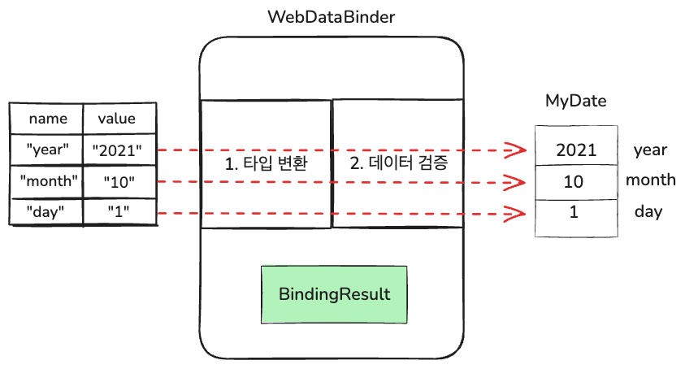

# Spring Summary

# Spring 애플리케이션의 기본 구조

## 원격 프로그램 등록 & 연결

- @Controller → Spring에게 **이 클래스가 웹 요청을 처리하는 컨트롤러임을 알림**
- @RequestMapping(URL, method = GET/POST) → 특정 URL과 메서드를 매핑

## Spring 컨트롤러의 메서드 실행 과정

- 컨트롤러 인스턴스 메서드는 톰켓이 대신 객체를 생성하고 메서드를 호출하기 때문에 객체 생성 없이 사용 가능
- **📌 왜 인스턴스 메서드로 만들까?**
- **인스턴스 메서드**는 **클래스 변수(CV), 인스턴스 변수(IV) 모두 사용 가능**하기 때문.
- static 메서드는 **클래스 변수(CV)만 사용 가능**하므로 제한적임.
- Spring MVC에서는 **컨트롤러를 싱글턴 빈으로 등록**하고, **톰캣이 객체를 생성하여 사용**하기 때문에 **static이 필요 없음**.

## Spring 컨트롤러의 메서드는 private로 변경해도 호출 가능한가?

- 가능하지만 public이 권장된다.
- **Spring이 Reflection API를 사용하여 private 메서드라도 호출 가능하게 함.**
- Reflection API는 **클래스의 정보를 런타임에 가져와서 조작할 수 있는 기능**을 제공함.

## **Spring MVC의 요청 처리 과정**

- 1️⃣ **클라이언트가 URL 요청 (**/hello**)**
- 2️⃣ **Tomcat이 요청을 받고** HttpServletRequest **객체 생성**
- 3️⃣ **요청 정보를** request **객체에 담음**
- 4️⃣ **Spring DispatcherServlet이 컨트롤러 메서드를 찾아 매핑**
- 5️⃣ **컨트롤러 메서드의 매개변수(**HttpServletRequest request**)에** request **객체를 전달**
- 6️⃣ **컨트롤러가 데이터를 처리한 후 결과를 반환**
- 7️⃣ **Spring의 ViewResolver가 해당 뷰를 찾아 클라이언트에게 응답**

## HttpServletResponse를 이용한 응답 처리

**📌 Response 객체의 역할**

- 클라이언트에게 **응답을 보내는 역할**을 함.
- setContentType("text/html")을 호출해야 브라우저가 응답을 올바르게 해석 가능.

### MIME

- 텍스트 기반 프로토콜에 바이너리 데이터 전송하기 위해서 고안되었다.

많이 사용되는 타입 예시)

| **타입**      | **설명**          | **MIME타입 예시(타입/서브타입)**                                                                                                            |
|-------------|-----------------|-----------------------------------------------------------------------------------------------------------------------------------|
| text        | 텍스트를 포함하는 모든 문서 | text/plain, text/html, text/css, text/javascript                                                                                  |
| image       | 모든 종류의 이미지      | image/bmp, image/webp                                                                                                             |
| audio       | 모든 종류의 오디오 파일   | audio/midi, audio/mpeg,audio/webm, audio/ogg,audio/wav                                                                            |
| video       | 모든 종류의 비디오 파일   | video/webm, video/ogg                                                                                                             |
| application | 모든 종류의 이진 데이터   | application/octetstream,application/pkcs12, application/vnd.mspowerpoint, application/xhtml+xml, application/xml, application/pdf |
|             |                 |                                                                                                                                   |

### Base64

Base64는 바이너리 데이터를 문자 데이터(ASCII)로 변환하는 인코딩 방식

- 2진법 = base2 = 0, 1
- 10진법 = base10 = 0~9
- **16진법 (Base16, Hex)** → 0 ~ 9, A ~ F
- 64진법 = A~Z, a-z, 0~9, +, / ⇒ 모두 64개(6bit)의 문자로 구성

HTML 링크가 있어서 편하지만 링크가 깨지기 쉽다. 하지만 HTML에 글자로 다 박으면 안깨지긴한다.

### 바이너리 파일 vs 텍스트 파일

- 바이너리 파일: 문자와 숫자 저장
- 텍스트 파일: 문자만 저장, 숫자는 문자로 변환

# Spring MVC

Spring MVC는 **입력(DispatcherServlet) → 처리(Service) → 출력(View)** 흐름으로 동작함.

## 입력 (DispatcherServlet)

- **DispatcherServlet**은 사용자의 HTTP 요청을 받아 컨트롤러로 전달하는 역할

```
// 매개변수 처리의 진화 과정
public void main(HttpServletRequest request) { }  // 원시적인 방식

public void main(@RequestParam String year) { }  // 요청 데이터를 직접 받음

public void main(@RequestParam int year, @RequestParam int month, @RequestParam int day) { }  // 여러 개의 데이터 처리

public void main(@ModelAttribute MyData myData) { }  // 객체 바인딩
```

- 요청 데이터를 객체로 받을 수 있도록 발전하여, @ModelAttribute**를 이용해 편리하게 데이터 바인딩 가능**

## 처리 (Service & Model)

- Model을 이용한 데이터 처리

```
@Controller
public class MyController {

    @RequestMapping("/process")
    public String process(@RequestParam String name, Model model) {
        String message = "Hello, " + name + "!";
        model.addAttribute("msg", message);  // Model에 데이터 저장
        return "result";  // View 이름 반환
    }
}
```

## 출력(View)

- **DispatcherServlet이 View로 데이터를 전달하여 최종 출력**

## ModelAndView

**모델과 뷰를 하나로 합친 개념**

- **DispatcherServlet이 Model을 View로 전달하는 구조**
- 최근에는 거의 사용되지 않는다

💡 **오해하면 안 되는 점!**

👉 사용자의 입력값을 Model이 직접 받는 것이 아님!

👉 사용자의 입력값을 @RequestParam, @ModelAttribute 등이 받고, **Model은 단순히 데이터를 View로 전달하는 역할**

## **Reflection API**

**런타임에 동적으로 클래스, 메서드, 필드에 접근하고 수정할 수 있음**

- Spring은 **Reflection API를 활용해 빈을 생성하고, private 메서드도 호출 가능**
- **객체지향 원칙을 훼손할 수 있으므로 꼭 필요할 때만 사용해야 함**

## ViewResolver

**컨트롤러에서 반환한 논리적 뷰 이름을 실제 물리적 뷰 경로로 변환**

예시)

```
@Controller
public class MyController {
    @RequestMapping("/home")
    public String home() {
        return "home";  // 실제 파일: "/WEB-INF/views/home.jsp"
    }
}
```

## 데이터 저장소

각 저장소는 Map 구조를 사용하며, 범위와 생명주기에 따라 다르다.

| 저장소          | 접근 범위       | 생존 기간     | 설명                        |
|--------------|-------------|:----------|---------------------------|
| pageContetxt | 현재 페이지      | 요청 완료 시   | 페이지 내에서만 사용 가능 (초기화됨)     |
| request      | 요청 간        | 요청 완료 시   | 요청이 끝나면 삭제된다.(주로 사용)      |
| session      | 사용자별 저장     | 브라우저 종료 시 | 쿠키 기반 사용자 정보 저장(서버 부담 크다) |
| application  | 웹 애플리케이션 전체 | 서버 종료 시   | 전역적으로 공유(보안문제 주의)         |
|              |             |           |                           |

# 요청과 응답

## 클라이언트와 서버의 통신 과정

1.클라이언트의 요청

- 클라이언트가 HTTP 요청을 보냄
- 요청은 서버의 8080 포트로 전달됨
- 프로토콜 지정 (HTTP/1.1, HTTP/2, AJP 등)

2.톰켓(WAS)의 요청 접수

- 톰캣의 Thread Pool이 요청을 접수
- Thread Pool: 다수의 스레드를 미리 생성하여 요청 처리를 분담
- 들어온 HTTP 요청을 ServletRequest 객체로 변환

3.요청 라우팅

- URL 분석 수행
- 적절한 서블릿으로 매핑
- 요청 처리할 서블릿 결정

📌 톰켓의 구조

- Service → Engine → Host → Context → Servlet 계층 구조

📌 서블릿의 처리

- DispatcherServlet이 요청 수신
- HTTP 메서드(GET/POST)에 따른 처리
- @RequestMapping이 된 컨트롤러 메서드 호출
- 비즈니스 로직 실행
- 처리 결과를 클라이언트에게 반환



### 톰캣 내부구조

- Connection Pool에서 요청당 하나씩 쓰레드 할당 -> Thread per Request
- 가상 스레드: I/O 블로킹 상황 처리
    - I/O 블로킹은 사용자 입력할 때 자주 발생 (예: 통신 프로그램)
    - 가상 스레드로 효율적 처리
- 프로그램 그룹 -> 프로젝트(Context)에 Connector 연결
- Servlet: 아래에서 설명

## WebDataBinder

- 브라우저를 통해서 요청받은 값이 실제 객체에 binding될 때 중간 역할을 해준다.


위와 같은 경우에
year=2021&month=10&day=1 이렇게 되어 있을때
`@ModelAttribute` 을 쓰면 쿼리스트링 뒤에 데이터가 Map의 value 값으로 들어간다.
`@RequestParam`, `@RequestMapping` 도 마찬가지로 WebDataBinder를 사용하여 매핑.

### @ModelAttribute

- 적용대상을 Model의 속성으로 자동 추가해주는 어노테이션

`public String main(@ModelAttribute Mydate date, Model m)`

이렇게 쓰면 Model Map에 MyDate를 키로 자동 저장한다. 수동으로 안써주면 첫글자를 소문자로 바꿔서 키에 넣는다

### @RequestParam

- 기본형, String일(단일 파라미터) 때 생략 되어 있다고 생각하면 된다.
- view에서 바로 ${param.파라미터이름} 이렇게 참조가 가능하기 때문에 model에 저장이 필요 없다.

### @RequestMapping

- 내부적으로 WebDataBinder를 활용하여 요청 데이터를 컨트롤러의 매개변수에 매핑하며, 단순히 URL을 매핑하는 역할

### @RequestBody

- **HTTP 본문(JSON 등)을 객체로 변환**하는 역할을 하며, WebDataBinder 대신 HttpMessageConverter를 사용

# 서블릿

## Servlet

- 서블릿은 Java 기반으로 웹 요청(HTTP)을 처리하기 위해 만들어진 자바 클래스
- Servlet API를 통해 웹 컨테이너(톰켓)상에서 동작하며, HTTP요청을받아 필요한 비즈니스 로직을 수행하고 결과를 HTTP 응답의 형태로 되돌려주는 역할을 한다.
- 서블릿은 싱글톤으로 관리되며, 최초 요청 시 생성된다.(싱글톤 구조이기 때문에 요청이 많아도 새로운 인스턴스 만들지 않는다. )

### Servlet의 life Cycle

2. 클라이언트의 요청
3. 톰켓이 Servlet Context에서 서블릿 객체가 존재하는지 확인
4. 없다면 Servlet 클래스를 로딩 -> init() -> service() / 있다면 바로 service()
5. 클라이언트에게 응답 반환

### 서블릿은 싱글톤이지만 멀티스레드를 지원한다!

- 서블릿내에 인스턴스 변수가 없기 때문에 싱글톤이여도 괜찮음. 전부 로컬변수 이기 때문에.

참고내용)
👉DispatcherServlet: 내부적으로 HttpServlet을 상속받은 서블릿.
👉Servlet-Context: 서블릿 컨테이너의 전역 설정과 데이터 저장을 담당하는 객체

## 서블릿 URL 매핑 및 등록 방식 정리

### **URL 매핑 방식 (@WebServlet)**

1. exact mapping : 특정 URL과 정확히 일치해야 서블릿이 실행된다.
2. path mapping :  특정 패턴을 포함하는 URL과 매핑 가능 ( / * 사용 )
3. extension mapping : 특정 확장자를 가진 URL과 매핑 ( * .do -> test.do 등의 URL 처리)
4. 디폴트: 모든 요청을 특정 서블릿으로 전달하는 매핑 ( / * : 모든 요청을 이 서블릿에서 처리)

## JSP

자바 서버 페이지(HTML안에 자바 코드가 있다) = 서블릿(자바 코드 안에 HTML)으로 자동으로 변환된다

- JSP페이지는 따로 맵핑해줄 필요가 없다. 자동으로 맵핑됨
- JSP페이지 호출만 해주면 된다.

    - 데이터 접근 계층 (Persistence Layer)

# 페이지의 이동

## Redirect

![[스크린샷 2025-02-13 오전 10.22.49.png]]

- 새로운 URL로 재요청(요청 2번, 응답 1번)
- 요청을 Web Browser에게 전달하여 새로 요청하게 만든다. 두번의 통신으로 속도 저하.
- request에 데이터 저장 불가
  ![[스크린샷 2025-02-13 오전 10.24.11.png]]
- 사진 처럼 다른 서버로의 요청도 가능

## Forward

![[스크린샷 2025-02-13 오전 10.21.38.png]]

- 서버 내부에서 페이지 전환(요청 1번, 응답 1번)
- 페이지 이동 없이 WAS 내부에서 다른 리소스를 호출하기 때문에 Redirect보다 빠르다.
- request에 데이터 저장 가능

# 쿠키와 세션

#쿠키 #세션

## 쿠키(Cookie)

- 사용자 식별 정보
- name-value 쌍 (ASCII 문자만 가능)
- 경로, 도메인, 유효기간 지정
- 브라우저에 저장
- 주요 용도: 팝업 처리, 사용자 식별

"세션은 지문인식이라서 쿠키를 들고가면 서버에서 인증 가능" 하다고 생각하면된다.
![[스크린샷 2024-12-02 오전 10.50.22.png]]
브라우저에서 볼 수 있는 이것들은 전부 쿠키임
위에쿠키는 세션의ID이고 아래쿠키는 로그인 정보(id, pwd)를 담고 있다

### 쿠키 처리 흐름

1. 서버에서 쿠키 생성 후 클라이언트(브라우저)에 저장한다.
2. 클라이언트가 서버로 요청 시 쿠키를 전달한다.
3. 서버는 쿠키 값을 이용해 사용자 식별 및 처리진행

## 세션(Session)

- 브라우저별 개별 저장소를 서버에 제공
- 관련 요청들을 하나의 묶음으로 관리
- 서버에 데이터 저장(Map의 형태)
- 요청과 응답이 1:1관계를 유지
- 서버 부담이 크므로 최소한으로 사용하기를 권장한다.

### 세션 처리

```java
// 세션 획득
HttpSession session = request.getSession();

// Spring MVC에서는 직접 파라미터로 받기 가능
public String method(HttpSession session) {
}
```

### 세션 종료

1. 수동 종료: invalidate() 호출
2. 자동 종료: 설정된 시간 경과

## 쿠키와 세션의 사용

### 쿠키만 사용하는 경우

- 사용자 선호 설정(다크 모드)
- 방문 기록 추적
- "다시 보지 않기"팝업 설정

### 세션만 사용하는 경우

- 민감한 사용자 정보 관리
- 임시 데이터 저장
- 보안이 중요한 결제 시스템

### 쿠키와 세션의 조합

쿠키와 세션을 함께 사용하는 경우

- 로그인 시스템: 세션 ID를 쿠키에 저장하고, 사용자 정보는 서버 세션에 저장
- 장바구니 기능:
    - 비로그인 사용자: 쿠키에 저장
    - 로그인 사용자: 세션에 저장
- 사용자 설정:
    - 테마, 언어 선호도 -> 쿠키 저장
    - 개인정보 -> 세션 저장

# DAO와 Repository

Data에 access하기 위한 object(실제로 DB에 접근하는 객체)이다.

- 서비스와 객체를 연결하는 역할

| 비교 항목 | DAO (Data Access Object) | Repository (Spring Data JPA)                                    |
|-------|--------------------------|-----------------------------------------------------------------|
| 개념    | 데이터베이스 접근을 담당하는 객체       | 도메인 엔티티의 영속성을 관리하는 인터페이스                                        |
| 패러다임  | 명시적인 SQL 사용 (MyBatis 등)  | 객체 중심의 데이터 접근 (JPA)                                             |
| 사용 방식 | SQL 문을 직접 작성             | JPA의 **EntityManager** 또는 Spring Data JPA의 **JpaRepository** 활용 |
| 필요성   | SQL 기반 프레임워크에서 필수        | JPA에서는 **자동으로 구현**되므로 별도 DAO 불필요                                |

- DAO는 MyBatis에서 주로 사용
- JPA에서는 DAO대신 Repository를 사용하며, SQL을 직접 작성해야할 경우 @Query나 QueryDSL을 사용 한다.

# DI(Dependency Injection)

![[스크린샷 2024-11-26 오후 8.37.19.png]]

## 객체 컨테이너(A.C.)

- ac.getBean("car")는 Object 타입을 반환 -> 형변환 필요
- Properties: (String, String) 저장
- Map: (String, Object) 저장
- **Reflection API**를 이용하여 Properties의 값을 Object로 변환 → Map으로 변환 가능
- getObject 메서드의 역할을 getBean으로 변경하여 사용

## 자동 객체 등록 (Component Scanning)

### **객체 등록 방식**

1. config.txt 파일에 등록 → AppContext에서 읽어와 Map에 저장
2. **Component Scanning**
    - @Component가 붙은 클래스를 **ApplicationContext(객체 저장소)**에 자동 등록
    - **클래스의 첫 글자를 소문자로 변환하여 key로 저장**, value는 객체로 생성 후 등록

### **Application Context의 역할**

1. **Bean 생성 및 설정, 생명주기 관리**
2. **의존성 주입(DI)**: 빈 간의 의존성을 자동 주입하여 객체 관계 설정

## 객체 찾기(by Name, by Type)

**1) 이름(key)으로 검색**

- 문자열(Resource)로 **key를 이용하여** getBean**으로 검색**

**2) 타입(value)으로 검색**

- for 문을 돌면서 instanceof로 객체 타입 검사

## 의존성 주입 (DI)

### 의존성이란?

클래스 A 와 클래스 B가 존재할 때 클래스 A안에 클래스 B가 import 되어 있으면 classA는 classB를 의존한다 라고 볼 수 있다.
의존성 주입이란 클래스 A가 필요한 클래스 B의 객체를 스스로 생성하지 않고, 외부에서 주입받는 방식을 말한다. 이를통해 의존성 역전이 가능해진 것.  (인터페이스(추상화)에 의존하게 됨)

spring은 IoC를 DI로 지원한다

📌 IoC(Inversion of Control)는 객체의 생성과 의존성 관리를 개발자가 아닌 외부 컨테이너에 맡기는 설계 원칙으로 스프링에서 이를 구현한 객체 관리 시스템을 IoC컨테이너라고 부른다.

스프링은 IoC컨테이너(스프링 컨테이너)의 인터페이스로 ApplicationContext를 제공한다.
ApplicationContext는 BeanFactory(생성정보를 가져옴)를 확장한 인터페이스이다.

#### ApplicationContext의 주요 구현체들

- **`AnnotationConfigApplicationContext`**: 자바 기반 설정(`@Configuration`)을 사용.
- **`ClassPathXmlApplicationContext`**: XML 파일을 클래스패스에서 로드.
- **`WebApplicationContext`**: Spring MVC와 같은 웹 환경에서 사용.

### 스프링이 의존성 역전을 하기 위한 조건 두가지

1. 내가 사용하는 클래스를 알아야한다
   어떻게 알까?
    - 설정파일 : 등록할 Bean의 범위를 지정한다.
    - 클래스, 애너테이션 : 등록할 Bean의 대상을 지정한다.
      spring에서는 `web.xml`을 통해 `DispatcherServlet`이 로드되면, 이 시점에 `ApplicationContext`가 초기화
      spring boot 에서는 @springbootApplication이 기준이 되어 해당 클래스가 위치한 패키지를 기준으로 하위 패키지를 모두 스캔 후 ApplicationContext를 초기화

   `@Component`, `@Bean`, XML 설정 을 통해서 빈을 등록.
   (@Configuration, @Bean 수동 등록 / @Component로 자동 등록)

2. 사용할 클래스의 정보를 미리 준비해야 한다.
   어떻게 미리 준비(Bean을 생성)할까?
    - AutoWired
    - 설정파일
    - 생성자
    - setter -> 이젠 안쓰임
      📌 getBean을 할 때 해당 클래스에 생성정보를 토대로 클래스를 가지고 올 때 만약ApplicationContext에 이미 있으면 바로 쓰고 없으면 위 1번에서의 정보(범위, 어떤게 필요한지)를 토대로
      생성한다.

# Filter (코드 중복과 관리)

전처리부분과 후처리 부분을 앞으로 뺀다(Frilter로) -> 코드가 간결해진다.
AOP개념이 이와 유사하다.

### Filter가 여러개일 때

요청 -> Filter1 / 전처리하고 -> Filter2 / 전처리 후 서블릿 호출 -> 서블릿 처리 -> Filter2 후처리 -> Filter1 후처리

요청과 응답을 처리하는데 사용되는 Java 클래스
서블릿, JSP로 가기 전에 요청을 가로채거나 응답이 클라이언트로 전달되기 전에 데이터를 수정, 로깅, 인코딩, 인증, 권한체크 하는데 사용

** 스프링 시큐리티가 이걸 활용한다. **

# AOP (Aspect Oriented Programming)

## AOP (Aspect-Oriented Programming)란?

- **서로 다른 모듈, 계층에서 공통적으로 쓰이는 부분을 분리하여 적용하는 프로그래밍 기법**
- **핵심 기능(target) 외의 부가 기능(advice 등)을 동적으로 추가** (직접 삽입하는 것이 아니라 “남이 넣어줌”)
- **메서드의 시작 또는 끝에 자동으로 코드(advice, 부가 기능)를 추가하는 기술**

즉, 공통 기능을 분리하여 동적으로 적용할 수 있도록 하는 것이 AOP

## AOP의 동작 방식

- Target 객체(핵심 로직)과 Advice 객체(부가 기능)를 분리하여 관리
- 실행 중(runtime)에 이 두 객체를 합쳐주는 역할을 하는 것이 Proxy
- AOP는 **Proxy 객체를 생성하여 target 메서드 실행 전후에 부가 기능을 삽입

## AOP의 활용

- 로깅, 인증, 트랜잭션 관리 등을 비즈니스 로직과 분리하여 비즈니스 로직(Service Layer)만 집중하도록 설계 가능

# 트랜잭션

## 트랜잭션의 정의

- 분할할 수 없는 작업의 단위
- 예: 계좌이체 (출금+입금이 모두 성공해야 함)

## 트랜잭션의 특성

2. Atomicity (원자성): 전체가 성공 또는 실패
3. Consistency (일관성): 실행 전후 데이터 일관성 유지
4. Isolation (고립성): 트랜잭션 간 독립성 보장
5. Durability (영속성): 완료된 트랜잭션 결과 영구 저장

## 트랜잭션 관리

### 커밋과 롤백

- 커밋: DB에 영구 저장
- 롤백: 최근 변경사항 취소

### TransactionManager

TransactionManagaer가 같은 트랜잭션 내에서 같은 connection을 사용할 수 있게 관리해준다.

📌 트랜잭션은 1개의 Connection에서 이루어져야 한다.

- 커넥션 풀 관리
- @Transactional 어노테이션 사용

```java
@Transactional(
        readOnly = true,
        rollbackFor = Exception.class,
        propagation = Propagation.REQUIRED
)
```

## Propagation

- REQUIRED: 기존 트랜잭션 사용/새로 생성
- REQUIRES_NEW: 항상 새 트랜잭션 생성

트랜잭션의 경계를 명확히 정의함으로써, 데이터의 일관성과 무결성을 보장한다.

### 주요 격리 수준

| **격리 수준**          | **설명**                                                                                     | **문제 방지**                          |
|--------------------|--------------------------------------------------------------------------------------------|------------------------------------|
| `DEFAULT`          | 기본 데이터베이스 격리 수준 사용 (DBMS에 따라 다름).                                                          | DB 기본 설정에 의존.                      |
| `READ_UNCOMMITTED` | 커밋되지 않은 데이터를 읽을 수 있음. **Dirty Read**, **Non-Repeatable Read**, **Phantom Read** 발생 가능.     | 없음                                 |
| `READ_COMMITTED`   | 커밋된 데이터만 읽음. **Dirty Read** 방지, 그러나 **Non-Repeatable Read**와 **Phantom Read**는 발생 가능.      | Dirty Read 방지                      |
| `REPEATABLE_READ`  | 트랜잭션 동안 읽은 데이터가 변경되지 않음. **Non-Repeatable Read** 방지, 그러나 **Phantom Read**는 발생 가능.          | Dirty Read, Non-Repeatable Read 방지 |
| `SERIALIZABLE`     | 트랜잭션 간 완전한 격리. 동시성 성능 저하. **Dirty Read**, **Non-Repeatable Read**, **Phantom Read** 모두 방지. | 모든 문제 방지                           |

### 데이터 무결성 문제

| **문제 유형**               | **설명**                                               | **해결 격리 수준**         |
|-------------------------|------------------------------------------------------|----------------------|
| **Dirty Read**          | 트랜잭션이 다른 트랜잭션에서 커밋되지 않은 데이터를 읽음.                     | `READ_COMMITTED` 이상  |
| **Non-Repeatable Read** | 트랜잭션 중간에 다른 트랜잭션이 데이터를 수정하여 동일 데이터를 다시 읽을 때 결과가 달라짐. | `REPEATABLE_READ` 이상 |
| **Phantom Read**        | 트랜잭션 중간에 다른 트랜잭션이 데이터를 삽입하거나 삭제하여 쿼리 결과의 행 수가 달라짐.   | `SERIALIZABLE`       |
|                         |                                                      |                      |

사용예시)

```
@Transactional(isolation = Isolation.REPEATABLE_READ)
public void fetchData() {
    // 트랜잭션 동안 데이터 변경 방지
}
```

# 예외처리

## 예외처리 전략

- DAO: 예외 전파
- Service: 비즈니스 로직 관련 처리
- Controller: 사용자 피드백

## 롤백 정책

6. Exception
    - 선택적 롤백 (비즈니스 판단)
7. RuntimeException & Error
    - 필수 롤백 (기술적 문제)

## 예외처리 어노테이션

### @ExceptionHandler

**사용 사례**:

- 컨트롤러 내부에서 발생하는 특정 예외를 처리할 때 사용
- 간단한 로컬 예외 처리에 적합하며, 별도의 전역 예외 처리 클래스를 작성할 필요가 없을 때 유용

예시 코드

```
@Controller
public class UserController {

    @ExceptionHandler(NullPointerException.class)
    public String handleNullPointerException(Exception ex, Model model) {
        model.addAttribute("error", "잘못된 요청입니다.");
        return "error"; // error.jsp로 이동
    }
}

```

### @ControllerAdvice

**사용 사례**:

- 애플리케이션 전역에서 발생하는 예외를 공통적으로 처리
- 동일한 예외 처리 로직을 여러 컨트롤러에서 재사용하고 싶을 때 적합

예시 코드

```
@ControllerAdvice
public class GlobalExceptionHandler {

    @ExceptionHandler(RuntimeException.class)
    public String handleRuntimeException(RuntimeException ex, Model model) {
        model.addAttribute("error", "서버에서 오류가 발생했습니다.");
        return "globalError"; // globalError.jsp로 이동
    }
}

```

### @ResponseStatus

**사용 사례**:

- 예외 처리 시 HTTP 상태 코드를 명확히 설정
- 기본적으로 Spring은 예외 발생 시 HTTP 상태 코드를 `200 OK`로 반환하므로, 이를 적절한 상태 코드로 변경할 필요가 있음

예시코드

```
@ResponseStatus(HttpStatus.NOT_FOUND)
public class ResourceNotFoundException extends RuntimeException {
    public ResourceNotFoundException(String message) {
        super(message);
    }
}

@Controller
public class ProductController {

    @GetMapping("/product/{id}")
    public String getProduct(@PathVariable String id) {
        if (id.equals("0")) {
            throw new ResourceNotFoundException("Product not found");
        }
        return "productDetail";
    }
}
```

### @RestControllerAdvice

**사용 사례**:

- **REST API** 전용 예외 처리
- JSON 형식으로 에러 응답을 반환해야 할 때 적합

코드 예시

```
@RestControllerAdvice
public class ApiExceptionHandler {

    @ExceptionHandler( IllegalArgumentException.class)
    public ResponseEntity<Map<String, String>> handleIllegalArgumentException(IllegalArgumentException ex) {
        Map<String, String> response = new HashMap<>();
        response.put("error", ex.getMessage());
        return ResponseEntity.badRequest().body(response);
    }
}
```

### 각 사용예시

- **@ControllerAdvice**: 전역적인 예외 처리를 설정
- **@ExceptionHandler**: 컨트롤러 내에서 특화된 예외 처리
- **@ResponseStatus**: 상태 코드를 명확히 설정
- **@RestControllerAdvice**: REST API 전용 예외 처리

@ControllerAdvice는 뷰 기반의 MVC 애플리케이션에서 전역 예외 처리를 지원한다.
@RestControllerAdvice는 REST API에서 JSON 또는 XML과 같은 응답을 생성하는 데 사용된다.


