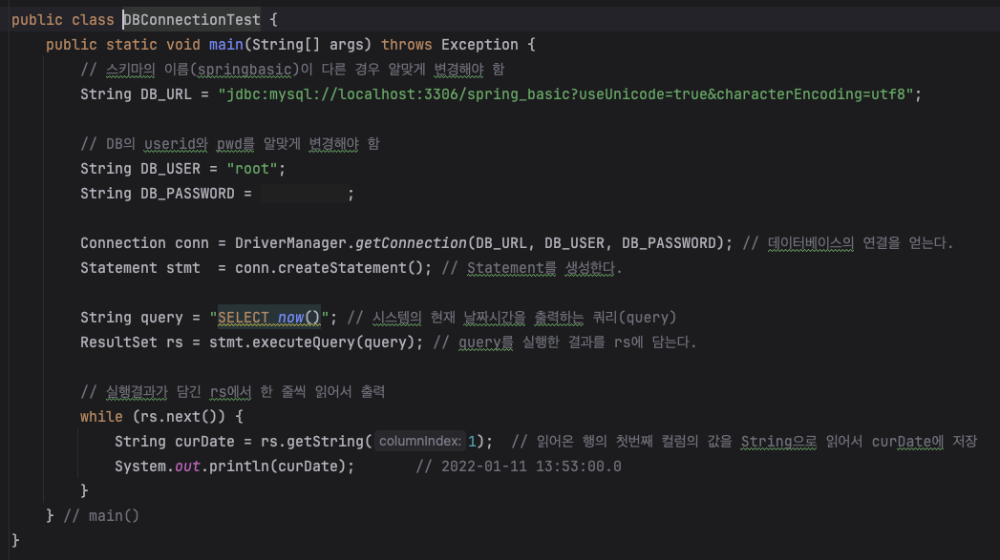
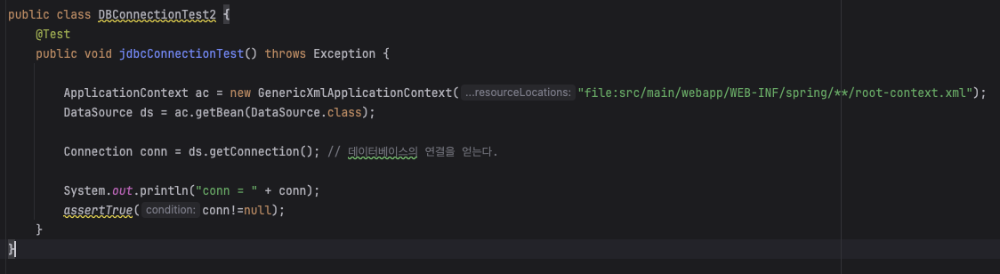
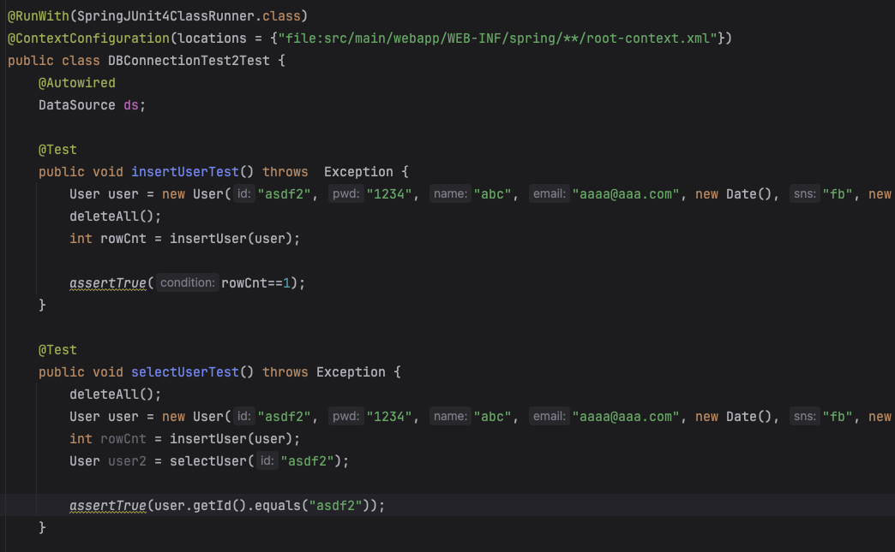

# 1. 하드 코딩

데이터베이스 연결정보를 코드에 직접 작성하는 방식
-> 개발자가 직접 DriverManager를 관리한다.

## 문제점

- DB 비밀번호가 코드에 노출 - 보안 문제
- DB정보가 변경될때마다 다시 수정 및 컴파일 해야함
- 여러 환경에서의 설정관리 어려움

# 2. XML 설정

Spring설정 파일 (root-context.xml)에 DB의 URL, 사용자 이름, 비밀번호를 명시한다.
-> 스프링이 관리한다

## 문제점

- xml은 가독성이 낮아 디버깅, 수정이 어려움
- 의존성이나 설정간의 관계를 파악하기 어렵다.

# 3. 의존성 주입

DI를 통해 자동으로 DataSource 주입. (원래 Test는 스프링과 독립적으로 실행해야 한다.)
스프링 테스트 환경 설정을 위해 @RunWith, @ContextConfigration 두가지 어노테이션 사용

